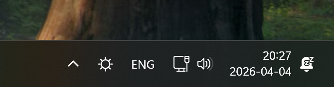

# HDR Switcher

A minimal Windows 11 system tray app that toggles HDR on your displays with a single click — and automatically enables HDR when you launch a game, then restores the previous state when you exit.

## Why

Keeping HDR always on isn't ideal — it affects colour mapping for SDR content, so you often want to switch it off when not watching HDR media or playing a game. But checking whether HDR is currently on requires opening Windows Settings, and toggling it means either navigating the Settings UI or using a keyboard shortcut that's easy to forget.

HDR Switcher puts the current state in your system tray at a glance, lets you toggle it with a single click, and handles the game launch/exit cycle automatically.



---

## Features

- **Left-click** the tray icon to toggle HDR on the primary display
- **Right-click** for a context menu with per-monitor controls
- Icon reflects current HDR state — filled sun (on) / outlined sun (off)
- Reacts instantly when HDR is changed externally (Windows Settings, other apps)
- **Game monitoring** — detects launched games from Steam, Epic Games, and Xbox Game Pass; automatically enables HDR on launch and restores the previous state on exit
- **Settings window** — blacklist games that should not trigger HDR, or add any game manually by exe path
- Optional autostart with Windows
- Single self-contained `.exe`, no installer, no runtime required

---

## Installation

1. Download `HdrSwitcher.exe` from [Releases](../../releases)
2. Run it — the sun icon appears in the system tray
3. Optionally right-click → **Start with Windows** to enable autostart

To uninstall: right-click → **Exit**, then delete the `.exe`. If autostart was enabled, disable it first (or delete the registry value at `HKCU\Software\Microsoft\Windows\CurrentVersion\Run\HdrSwitcher`).

---

## Usage

| Action | Result |
|--------|--------|
| Left-click tray icon | Toggle HDR on primary display |
| Right-click → display name | Toggle HDR on that specific display |
| Right-click → Settings… | Open the settings window |
| Right-click → Open log | Open the activity log in Notepad |
| Right-click → Exit | Quit |

### Icon states

| Icon | Meaning |
|------|---------|
| ☀ (filled sun) | HDR is **on** |
| ☀ (outlined sun) | HDR is **off** |
| ☀ (dim filled sun) | **Mixed** — some displays on, some off |

---

## Game monitoring

HDR Switcher scans your game libraries at startup and monitors for game launches:

- **Steam** — reads `libraryfolders.vdf` and all `appmanifest_*.acf` files
- **Epic Games** — reads `.item` manifest files from `%PROGRAMDATA%\Epic\...`
- **Xbox / Game Pass** — reads `HKLM\SOFTWARE\Microsoft\GamingServices\GameConfig` and `AppxManifest.xml`

When a game is detected:
1. The current HDR state of all displays is saved
2. HDR is enabled on any display that was off
3. When the game exits, each display is restored to its pre-game state

Game libraries are rescanned every 30 minutes to pick up newly installed games.

---

## Log file

`hdr-switcher.log` is written next to the exe and records all HDR changes and game events. Open it via **right-click → Open log**.

```
[2026-04-05 18:51:56] === HDR Switcher started ===
[2026-04-05 18:51:56] HDR     [startup] MPG 274U E16M: ON (primary)
[2026-04-05 18:51:56] LIBRARY 29 games (Steam: 21, Epic: 0, Xbox: 8)
[2026-04-05 18:52:10] STARTED [Steam] Hozy
[2026-04-05 18:52:10]   → MPG 274U E16M: ON (primary) — HDR already ON on all, would do nothing
[2026-04-05 18:52:40] EXITED  [Steam] Hozy
[2026-04-05 18:52:40]   → HDR was already ON before game — would do nothing
[2026-04-05 18:52:44] HDR     [tray toggle] MPG 274U E16M: OFF (primary)
[2026-04-05 18:52:53] STARTED [Steam] Hozy
[2026-04-05 18:52:53]   → MPG 274U E16M: OFF (primary) — would enable HDR on: MPG 274U E16M
[2026-04-05 18:53:24] EXITED  [Steam] Hozy
[2026-04-05 18:53:24]   → would restore: MPG 274U E16M: OFF (primary)
```

---

## Requirements

- Windows 11 (or Windows 10 with HDR-capable display)
- A monitor that supports HDR (`DISPLAYCONFIG_ADVANCED_COLOR_INFO` reports `advancedColorSupported`)
- No .NET runtime needed — the runtime is bundled

---

## Building from source

```bash
git clone https://github.com/nismangulov/hdr-switcher
cd hdr-switcher
dotnet publish src/HdrSwitcher/HdrSwitcher.csproj -c Release -o publish/
```

Output: `publish/HdrSwitcher.exe` (~50 MB, self-contained)

### Requirements

- .NET 10 SDK (`winget install Microsoft.DotNet.SDK.10`)

### Running tests

```bash
dotnet test
```

---

## How it works

See [docs/how-it-works.md](docs/how-it-works.md) for a full technical walkthrough.

---

## License

MIT
